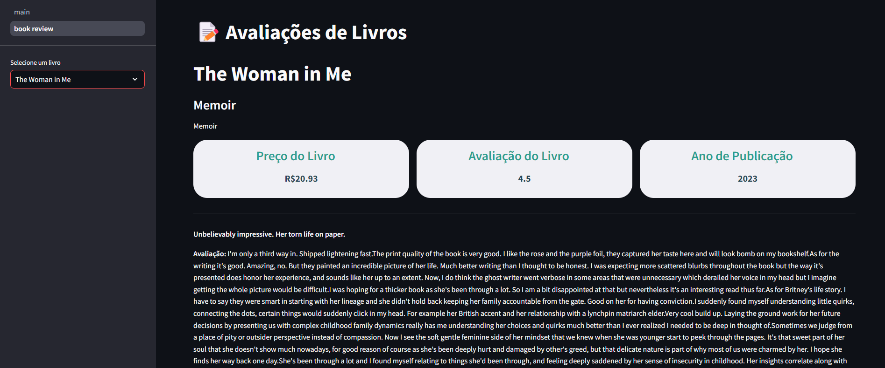
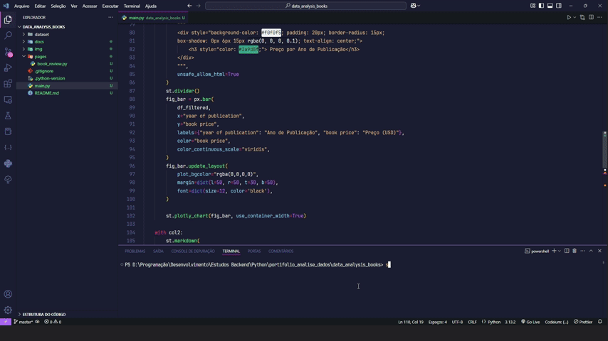

# Análise Comparativa de Preços de Livros📈

Este projeto oferece uma análise interativa de preços de livros, utilizando o Streamlit para exibir gráficos e métricas sobre os dados. Com ele, é possível explorar diferentes faixas de preço, anos de publicação e gêneros de livros, além de visualizar informações detalhadas sobre avaliações de livros selecionados.

## Funcionalidades

- **Filtragem de Livros**: Filtre os livros por preço, ano de publicação e gênero.
- **Gráficos Interativos**: Visualize o preço dos livros ao longo dos anos e a distribuição de preços com gráficos dinâmicos.
- **Métricas Rápidas**: Acompanhe informações como o número de livros, preço médio, preço mínimo e preço máximo de livros filtrados.
- **Avaliações de Livros**: Veja as avaliações dos livros selecionados, incluindo texto de revisões e ratings.

## Como Executar o Projeto

1. Clone este repositório:
   ```bash
   git clone https://github.com/seu-usuario/analise-precos-livros.git
   ```

2. Navegue até o diretório do projeto:
   ```bash
   cd analise-precos-livros
   ```

3. Instale as dependências:
   ```bash
   pip install -r requirements.txt
   ```

4. Execute o aplicativo Streamlit:
   ```bash
   streamlit run app.py
   ```

## Screenshots

### Tela Principal - Análise de Preços (Dark Mode)
Tela principal com análise detalhada e insights valiosos gerados pelo sistema.


### Tela de Avaliações de Livros (Dark Mode)
Tela de avaliações exibindo todos os reviews feitos por compradores, proporcionando insights sobre a experiência de leitura e a satisfação dos usuários.



## Vídeo do Sistema em Funcionamento

Confira um vídeo demonstrativo de como o sistema funciona:



## Dependencias Utilizadas

- **Streamlit**: Para criar a interface interativa.
- **Pandas**: Para manipulação e análise dos dados.
- **Plotly**: Para criação de gráficos interativos.
- **Python**: Linguagem de programação para processamento de dados.

## Contribuição

Se você deseja contribuir para este projeto, sinta-se à vontade para fazer um fork do repositório e enviar pull requests. Toda contribuição é bem-vinda!

---
